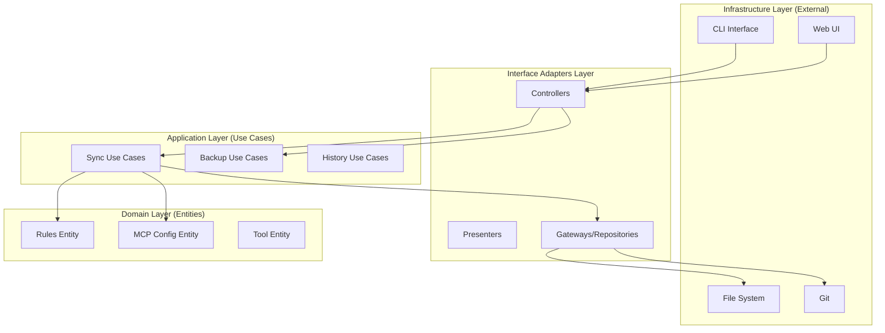

# AI CLI Syncer Architecture

## 1. Architectural Principles

우리는 **유지보수성(Maintainability)**, **테스트 용이성(Testability)**, **확장성(Scalability)**을 핵심 가치로 삼으며, 이를 달성하기 위해 다음 원칙을 준수합니다.

### 1.1 SOLID Principles

- **SRP (Single Responsibility Principle)**: 모든 클래스와 모듈은 단 하나의 변경 이유만을 가져야 합니다.
- **OCP (Open/Closed Principle)**: 확장에는 열려 있어야 하고, 변경에는 닫혀 있어야 합니다. (새로운 도구 추가 시 기존 코드 수정 최소화)
- **LSP (Liskov Substitution Principle)**: 상위 타입의 객체를 하위 타입의 객체로 치환해도 프로그램은 정상 작동해야 합니다.
- **ISP (Interface Segregation Principle)**: 클라이언트는 자신이 사용하지 않는 메서드에 의존하지 않아야 합니다.
- **DIP (Dependency Inversion Principle)**: 고수준 모듈은 저수준 모듈에 의존해서는 안 되며, 둘 다 추상화에 의존해야 합니다.

### 1.2 Clean Architecture (Layered)

관심사의 분리를 위해 시스템을 계층화합니다. 의존성은 항상 **안쪽(고수준 정책)**을 향해야 합니다.



## 2. Layer Details

### 2.1 Domain Layer

- **역할**: 핵심 비즈니스 로직과 엔티티를 정의합니다. 외부 라이브러리나 프레임워크에 의존하지 않습니다.
- **구성 요소**:
  - `Rule`: Rule의 내용과 메타데이터
  - `McpConfig`: MCP 서버 설정
  - `Tool`: AI 도구의 정의 (ID, 이름, 설정 경로 등)
  - `SyncStrategy`: 동기화 전략 인터페이스

### 2.2 Application Layer

- **역할**: 애플리케이션의 구체적인 유스케이스(Use Cases)를 구현합니다. 도메인 객체를 조작하여 사용자의 목표를 달성합니다.
- **구성 요소**:
  - `SyncRulesUseCase`: Rules 동기화 로직 오케스트레이션
  - `BackupUseCase`: 백업 생성 및 관리
  - `RestoreHistoryUseCase`: 히스토리 복원
- **특징**: 트랜잭션 관리, 로깅, 도메인 이벤트 발행 등을 담당합니다.

### 2.3 Interface Adapters Layer

- **역할**: 외부 세계(CLI, Web, DB)와 애플리케이션 내부 간의 데이터를 변환합니다.
- **구성 요소**:
  - `FileRepository`: 파일 시스템 접근 추상화 구현체
  - `GitRepository`: Git 명령 실행 추상화 구현체
  - `CliController`: CLI 명령어 입력을 유스케이스 입력으로 변환
  - `CliPresenter`: 유스케이스 결과를 CLI 출력 형식으로 변환

### 2.4 Infrastructure Layer

- **역할**: 세부 기술적인 구현 사항입니다.
- **구성 요소**:
  - `Node.js fs module`
  - `simple-git`
  - `commander` (CLI Framework)
  - `inquirer`

## 3. Implementation Strategy (Refactoring)

현재의 절차적 코드베이스를 위 아키텍처로 점진적으로 리팩토링합니다.

### 3.1 Dependency Injection (DI)

- 클래스 간의 결합도를 낮추기 위해 생성자 주입(Constructor Injection)을 사용합니다.
- DI 컨테이너(예: InversifyJS 또는 자체 구현)를 도입하여 의존성을 관리합니다.

### 3.2 Repository Pattern

- 파일 시스템 접근 로직(`fs.readFileSync` 등)을 `Repository` 인터페이스 뒤로 숨깁니다.
- 이를 통해 테스트 시 파일 시스템을 Mocking하기 쉬워집니다.

### 3.3 Strategy Pattern

- 동기화 전략(Overwrite, Merge, Smart Update)을 Strategy 패턴으로 구현하여 OCP를 준수합니다.
- 새로운 전략 추가 시 기존 코드를 수정할 필요가 없습니다.

## 4. 현재 구현된 디렉토리 구조

```text
packages/cli/src/
├── use-cases/           # Use Case Layer (비즈니스 로직)
│   ├── IUseCase.ts      # Use Case 기본 인터페이스
│   ├── rules/           # Rules 관련 Use Cases
│   │   ├── RulesDTOs.ts
│   │   ├── SyncRulesToToolUseCase.ts
│   │   ├── SyncRulesToAllToolsUseCase.ts
│   │   └── LoadMasterRulesUseCase.ts
│   └── mcp/             # MCP 관련 Use Cases
│       ├── McpDTOs.ts
│       ├── SyncMcpToToolUseCase.ts
│       ├── SyncMcpToAllToolsUseCase.ts
│       └── LoadMasterMcpUseCase.ts
├── interfaces/          # 인터페이스 정의 (DIP 적용)
│   ├── IFileSystem.ts   # 파일 시스템 추상화
│   ├── IRulesService.ts # Rules 서비스 인터페이스
│   ├── ISyncService.ts  # Sync 서비스 인터페이스
│   └── repositories/    # Repository 인터페이스
│       ├── IRulesConfigRepository.ts
│       ├── ISyncConfigRepository.ts
│       └── IGlobalConfigRepository.ts
├── infrastructure/      # 인프라 구현체
│   ├── NodeFileSystem.ts # Node.js fs/path 구현
│   └── repositories/     # Repository 구현체
│       ├── RulesConfigRepository.ts
│       ├── SyncConfigRepository.ts
│       └── GlobalConfigRepository.ts
├── services/
│   ├── impl/            # 서비스 구현체
│   │   ├── RulesService.ts # IRulesService 구현
│   │   └── SyncService.ts  # ISyncService 구현
│   ├── rules.ts         # 어댑터 (기존 호환성 유지)
│   ├── sync.ts          # 어댑터 (기존 호환성 유지)
│   ├── strategies.ts    # 동기화 전략
│   ├── history.ts       # 버전 관리
│   └── scanner.ts       # 도구 탐지
├── utils/               # 유틸리티
│   ├── backup.ts        # 백업 유틸
│   └── validation.ts    # 데이터 검증
├── constants/           # 상수 정의
│   └── tools.ts         # 도구 메타데이터
└── schemas/             # 스키마 정의
    ├── rules.schema.ts
    └── mcp.schema.ts
```

## 5. 리팩토링 현황 (완료)

### 5.1 Phase 1: 인터페이스 및 DI 도입

1. **IFileSystem 인터페이스 도입**
   - 파일 시스템 접근을 추상화하여 테스트 용이성 향상
   - `NodeFileSystem` 구현체로 실제 fs/path 모듈 사용

2. **RulesService 클래스화**
   - `IRulesService` 인터페이스 정의
   - 의존성 주입(DI)을 통한 `IFileSystem` 사용
   - 기존 `rules.ts`를 어댑터 패턴으로 변경하여 하위 호환성 유지

3. **SyncService 클래스화**
   - `ISyncService` 인터페이스 정의
   - 의존성 주입(DI)을 통한 `IFileSystem` 사용
   - 기존 `sync.ts`를 어댑터 패턴으로 변경
   - 순환 의존성 문제 해결

### 5.2 Phase 2: Repository 패턴 적용

1. **Repository 패턴 구현**
   - `IRulesConfigRepository`: Rules 설정 파일 접근 추상화
   - `ISyncConfigRepository`: MCP 동기화 설정 파일 접근 추상화
   - `IGlobalConfigRepository`: 전역 설정 파일 접근 추상화
   - 각 Repository 구현체 작성

### 5.3 Phase 3: Use Case Layer 도입

1. **Use Case 패턴 구현**
   - `IUseCase<TRequest, TResponse>` 제네릭 인터페이스
   - Rules Use Cases: SyncRulesToTool, SyncRulesToAllTools, LoadMasterRules
   - MCP Use Cases: SyncMcpToTool, SyncMcpToAllTools, LoadMasterMcp
   - Request/Response DTO 타입 정의

### 5.4 테스트 커버리지

1. **단위 테스트 작성**
   - Services 테스트: RulesService, SyncService, McpService, HistoryService 등
   - Repository 테스트: RulesConfigRepository, SyncConfigRepository, GlobalConfigRepository, McpRepository
   - Use Cases 테스트: Rules/MCP 관련 6개 Use Cases
   - Utils 테스트: validation, backup
   - **총 31개 테스트 파일, 309개 테스트 통과** ✅

2. **E2E 테스트**
   - Rules 관리 E2E 테스트
   - MCP Sets/Definitions E2E 테스트
   - 네비게이션 테스트

## 6. 아키텍처 레이어 구조

```
┌─────────────────────────────────────┐
│     Use Cases (비즈니스 로직)        │
│  - SyncRulesToToolUseCase           │
│  - SyncMcpToAllToolsUseCase         │
└──────────────┬──────────────────────┘
               │ depends on
┌──────────────▼──────────────────────┐
│     Services (도메인 로직)           │
│  - RulesService                     │
│  - SyncService                      │
└──────────────┬──────────────────────┘
               │ depends on
┌──────────────▼──────────────────────┐
│   Repositories (데이터 접근)         │
│  - RulesConfigRepository            │
│  - SyncConfigRepository             │
└──────────────┬──────────────────────┘
               │ depends on
┌──────────────▼──────────────────────┐
│  Infrastructure (파일 시스템)        │
│  - NodeFileSystem                   │
│  - fs, path modules                 │
└─────────────────────────────────────┘
```

## 7. SOLID 원칙 적용 현황

- ✅ **SRP**: 각 클래스/Use Case가 단일 책임
- ✅ **OCP**: 전략 패턴으로 확장에 열려있음
- ✅ **LSP**: 인터페이스 기반 구현으로 치환 가능
- ✅ **ISP**: 역할별 인터페이스 분리 (IFileSystem, IRulesService, ISyncService 등)
- ✅ **DIP**: 의존성 역전 (Use Case → Service → Repository → Infrastructure)

## 8. 다음 단계

1. **웹 UI 통합**
   - React 기반 웹 UI와 백엔드 API 연결
   - system.css 레트로 디자인 적용 완료

2. **문서화**
   - 사용자 가이드 작성
   - API 문서 작성

3. **배포 준비**
   - CI/CD 파이프라인 구축
   - 패키지 배포 준비
