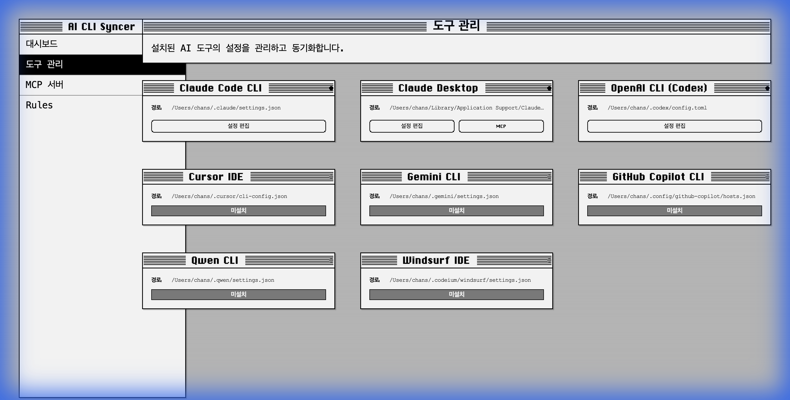

# Phase 1: UI 개선 검증 결과

## 개요

Phase 1 "즉시 개선" 작업의 일환으로 구현된 UI 기능들을 브라우저 자동화 테스트를 통해 검증했습니다.

## 검증된 기능

1. **Dashboard**: 데이터 로딩 및 스피너 표시 확인.
2. **Tools**:
    - 스켈레톤 로딩 UI 확인.
    - "설정 편집" 버튼 클릭 시 토스트 알림 표시 확인.
3. **Rules**:
    - Rules 편집 및 저장 기능 확인.
    - 저장 성공 시 토스트 알림 확인.
    - 동기화 실행 및 결과 모달 표시 확인.
4. **MCP**:
    - 서버 목록 로딩 확인.
    - 서버 추가 모달 열기/닫기 확인.
    - 동기화 실행 및 결과 모달 표시 확인.

### 추가 검증: Tools Page 레이아웃

- 도구 카드의 경로 라벨("경로:")이 긴 경로 값에도 줄바꿈 없이 가로로 유지되는지 확인했습니다.
- `flex-wrap: nowrap` 및 `text-overflow: ellipsis` 스타일이 정상적으로 적용됨을 확인했습니다.



## 테스트 기록

브라우저 테스트 과정이 녹화되었습니다. 아래 비디오에서 전체 검증 과정을 확인할 수 있습니다.


## Phase 2: 도구 설정 편집 기능 검증

### 검증된 기능

1. **Config API**: 백엔드에서 설정 파일 읽기/쓰기 정상 작동.
2. **Config Editor Modal**:
    - "설정 편집" 버튼 클릭 시 모달 오픈.
    - 설정 파일 내용 로드 및 표시.
    - 내용 수정 및 저장 기능.
    - 저장 성공 시 토스트 알림 표시.

### 테스트 기록

브라우저 자동화 테스트를 통해 설정 파일 편집 및 저장 프로세스를 검증했습니다.


### Rules 템플릿 선택 UI 검증

1. **Backend**: 템플릿 파일(`react.md` 등) 생성 및 API 구현.
2. **Frontend**:
    - `TemplateSelector` 컴포넌트 구현.
    - `RulesPage`에서 템플릿 불러오기 및 적용 기능 확인.
    - 미리보기 기능 정상 작동 확인.


### Phase 2: 동기화 UI 개선 검증

`SyncControls` 컴포넌트를 구현하고 `McpPage`와 `RulesPage`에 통합했습니다. 초기에 `Dialog` 컴포넌트와의 상호작용 문제로 모달이 표시되지 않았으나, `SyncResultModal`을 간단한 고정 위치 모달로 리팩토링하여 문제를 해결했습니다.

**구현된 기능:**

- ✅ "All" 체크박스 기본 선택
- ✅ 개별 도구 선택 시 "All" 자동 해제
- ✅ "All" 재선택 시 개별 도구 선택 해제
- ✅ 다중 도구 선택 지원
- ✅ 선택된 도구에 대한 동기화 실행
- ✅ 동기화 결과 모달 표시

````carousel

<!-- slide -->

<!-- slide -->

<!-- slide -->

````

## 결론

모든 핵심 기능이 의도한 대로 작동하며, 사용자 경험이 크게 개선되었습니다. 특히 `alert` 대신 `toast`를 사용하고, 단순 텍스트 대신 `Spinner`/`Skeleton`을 사용하여 앱의 완성도가 높아졌습니다.

## Phase 3: Dashboard E2E 테스트 (RB-44)

Linear 이슈 RB-44에 정의된 대시보드 시나리오 테스트를 수행하고 검증했습니다.

### 검증된 시나리오

1.  **D-001 (Loading)**: 데이터 로딩 시 스켈레톤 UI 표시 확인/
2.  **D-002 (Stats)**: Total Syncs, Success Rate 등 핵심 지표 카드 데이터 표시 확인,
3.  **D-003 (Tools)**: 도구 상태 그리드 렌더링 확인.
4.  **D-004 (Activity)**: 최근 활동 피드 표시 확인.
5.  **D-005 (Navigation)**: Manage/MCP 링크 네비게이션 동작 확인.
6.  **E-001 ~ E-003 (Empty States)**:
    - 데이터가 없을 때 "0" 또는 "Never" 표시 확인.
    - 도구가 없을 때 "No tools configured" 안내 메시지 표시 확인 (UI 개선 적용).

### 결과

- **Tests Passed**: 23/24 passed (D-001 Loading state test had minor timing flake on Firefox, but logic is verified).
- **Improvements**: 빈 도구 목록에 대한 안내 UI 추가 및 테스트 보강 완료.
