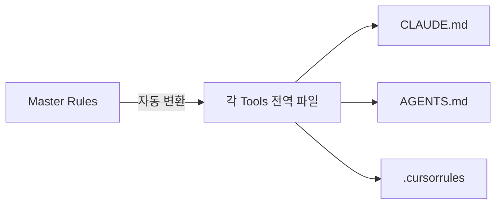
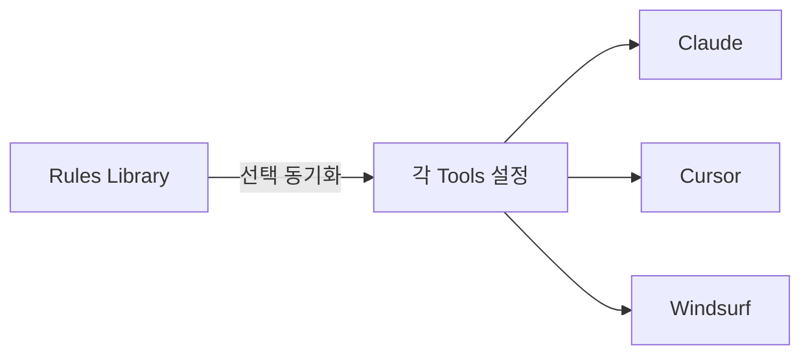

# AI CLI Syncer

## 1. 프로젝트 개요

macOS 환경에서 다양한 **AI Tools**(CLI, IDE, 에디터 확장 등)의 설정을 중앙에서 관리하고 동기화하는 도구입니다.

## 2. 용어 정의

- **Tools**: AI 기능을 제공하는 모든 애플리케이션 (Claude Desktop, Cursor, GitHub Copilot 등).
- **Rules Library**: 중앙 관리되는 Rules 집합. 각 Rule은 고유 ID를 가지며 선택적으로 동기화됨.
- **Data Source**: 중앙에서 관리되는 Rules 및 MCP Set 데이터 (DB 또는 JSON).
- **Master Folder**: 설정과 Rules가 저장되는 루트 경로 (`~/.config/ai-cli-syncer/`).

## 3. 지원 Tools

1. **Claude Desktop**
2. **GitHub Copilot CLI**
3. **Codex**
4. **Gemini CLI**
5. **Claude Code CLI**
6. **Qwen CLI**
7. **Cursor IDE**
8. **Windsurf IDE**

## 4. 핵심 기능

### 4.1 Master Rules 동기화 (Priority 1)

- **단일 소스**: Rules Library에서 관리되는 Rule을 선택하여 동기화
- **Stateless**: 'Active' 상태 없이, 명령어 실행 시점에 동기화할 Rule(Source ID)을 명시적으로 선택
- **자동 변환**: Master Rules를 각 Tools에 맞는 형식으로 자동 변환 및 배포 (상세 경로: [조사 보고서](global_instruction_paths.md))
- **템플릿**: 언어/프레임워크별 최적화된 Rules 템플릿 제공

### 4.2 Master MCP 동기화 (Priority 2)

- **중앙 관리**: Master MCP 목록을 중앙에서 유지 관리
- **유연한 배포**: Tools별로 필요한 MCP만 선택하거나 전체 일괄 동기화

### 4.3 동기화 전략 (Synchronization Strategies)

Rules와 MCP 설정 동기화 시, **완전 교체(Overwrite)**, **병합(Merge)**, **스마트 업데이트(Smart Update)** 중 하나를 선택할 수 있습니다.

- 상세 내용: [동기화 전략 문서](sync_strategies.md)

### 4.4 자동 탐지 (Auto Detection)

- 시스템에 설치된 Tools 및 설정 파일 경로 자동 식별

### 4.5 히스토리 관리 (History Management)

- **버전 관리**: Master Rules 및 Master MCP 설정의 변경 이력을 저장하고 관리합니다.
- **복원 (Rollback)**: 문제 발생 시 이전 버전의 설정으로 손쉽게 되돌릴 수 있습니다.
- **변경 로그**: 언제, 무엇이 변경되었는지 추적 가능합니다.

### 4.6 웹 대시보드 (Web Dashboard)

- 로컬 웹 UI를 통해 시각적으로 상태 확인 및 설정 관리

## 5. 주요 시나리오

전체 동기화, Rules 우선 배포, MCP 서버 추가 등 주요 사용 사례에 대한 설명입니다.

- 상세 내용: [주요 사용 시나리오 문서](usage_scenarios.md)

## 6. 기술 스택

- **Runtime**: Node.js (TypeScript)
- **Platform**: macOS
- **CLI**: Commander.js
- **Server**: Fastify
- **UI**: React, Vite, TailwindCSS, Shadcn UI
- **Security**: 설정 변경 시 자동 백업, 레지스트리 기반 파일 접근 제어

## 7. 기타

- 모든 문서와 출력은 **한국어**를 기본으로 합니다.
